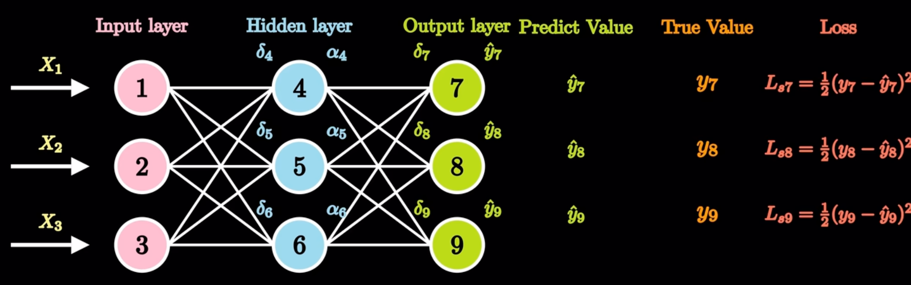

## 符号含义
### 输入层

- 输入:  $x_1,x_2,x_3$

### 隐藏层

- 输入：$\delta_4, \delta_5, \delta_6$
- 激活值：$\alpha_4, \alpha_5, \alpha_6$

### 输出层
- 输入：$\delta_7, \delta_8, \delta_9$
- 预测值：$\hat{y}_7, \hat{y}_8, \hat{y}_9$

### 其他
- 真实值：$y_7, y_8, y_9$
- 学习率:  $\eta$
- 激活函数: $\sigma(x)$, $\sigma(x)=\frac{1}{1+e^{-x}}$
- 损失函数：$L_{s7}, L_{s8}, L_{s9}$, $L_{s}=\frac{1}{2}(y - \hat{y})^2$ 
- 权重:  $\omega_{ij}$  (如神经元1, 4, 权重$\omega_{14}$)

---

## 正向传播

> 已知内容
- 输入数据：输入层的 $x_1$、$x_2$、$x_3$, 它们是网络接收的初始信息. 

- 权重:  $\omega_{ij}$  (如神经元1, 4, 权重$\omega_{14}$), 决定了信号传递的强度. 

- 激活函数: $\sigma(x)$, $\sigma(x)=\frac{1}{1+e^{-x}}$

- 损失函数：$L_{s}=\frac{1}{2}(y - \hat{y})^2$ 

- 真实值：即 $y_7$、$y_8$、$y_9$ , 可用于后续评估预测结果, 但不参与正向传播计算本身. 

  

> 需求内容
- 隐藏层激活值： $\alpha_4$、$\alpha_5$、$\alpha_6$ 这类隐藏层神经元经过加权求和并通过激活函数后的输出值. 

$$
\begin{gather*}
\alpha_i=\sigma(\delta_i),~~~~\delta_i=\omega_{1i} x_1+\omega_{2i} x_2+\omega_{3i} x_3,~~~~i=4,5,6\\
\\
e.g: \alpha_4=\sigma(\delta_4),~~~~\delta_4=\omega_{14} x_1+\omega_{24} x_2+\omega_{34} x_3,~~~~i=4,5,6
\end{gather*}
$$

- 输出层预测值： $\hat{y}_7$、$\hat{y}_8$、$\hat{y}_9$ , 这是网络针对输入数据给出的最终预测结果, 是正向传播的主要计算目标. 

$$
\begin{gather*}
\hat{y_i}=\sigma(\delta_i),~~~~\delta_i=\omega_{4i} \alpha_4+\omega_{5i} \alpha_5+\omega_{6i} \alpha_6,~~~~i=7,8,9\\
\\
e.g: \hat{y_7}=\sigma(\delta_7),~~~~\delta_7=\omega_{47} \alpha_4+\omega_{57} \alpha_5+\omega_{67} \alpha_6,~~~~i=7,8,9
\end{gather*}
$$

- 损失值（间接需求）：虽然不是正向传播直接计算得出, 但正向传播得到预测值后, 结合真实值（如 $y_7$、$y_8$、$y_9$ ）, 利用损失函数（如 $L_{s_7}$、$L_{s_8}$、$L_{s_9}$ 对应的均方误差公式 ）计算出损失值, 用于评估模型性能和后续反向传播优化 

$$
\begin{gather*}
L_{si}=\frac{1}{2}(y_i - \hat{y_i})^2,~~i=7,8,9\\
\\
e.g: L_{s7}=\frac{1}{2}(y_7 - \hat{y_7})^2
\end{gather*}
$$

## 反向传播

在这张图所示的神经网络反向传播过程中：
### 已知内容
- 正向传播结果：包括隐藏层激活值（如$\alpha_4$、$\alpha_5$、$\alpha_6$）和输出层预测值（如$\hat{y}_7$、$\hat{y}_8$、$\hat{y}_9$）

- 真实值：$y_7$、$y_8$、$y_9$

- 学习率:  $\eta$

- 损失函数：$L_{s}=\frac{1}{2}(y - \hat{y})^2$ 

- 权重:  $\omega_{ij}$  (如神经元1, 4, 权重$\omega_{14}$), 决定了信号传递的强度. 

- 激活函数: $\sigma(x)$, $\sigma(x)=\frac{1}{1+e^{-x}}$

  

### 要求内容
- 更新权重：$\hat{\omega_{ij}}$ 根据计算得到的权重梯度和学习率, 对权重进行更新

$$
\begin{gather*}
\frac{\partial L_{s7}}{\partial \hat{y}_{7}}= \frac{\partial  \frac{1}{2}(y_7 - \hat{y_7})^2}{\partial \hat{y}_{7}}=(\hat{y}_{7}-y_{7}),~~~~~
\frac{\partial \hat{y}_{7}}{\partial \delta_{7}}=\frac{\partial \sigma(\delta_7)}{\partial \delta_{7}}=\sigma(\delta_7)(1-\sigma(\delta_7))=\hat{y}_{7}(1-\hat{y}_{7}),\\
\\
\frac{\partial \delta_{7}}{\partial \omega_{47}}=\frac{\partial (\omega_{47} \alpha_4+\omega_{57} \alpha_5+\omega_{67} \alpha_6)}{\partial \omega_{47}} =\alpha_4,\\
\\
\text{权重梯度: }~~~\frac{\partial L_{s7}}{\partial \omega_{47}}= \frac{\partial L_{s7}}{\partial \hat{y}_{7}} \frac{\partial \hat{y}_{7}}{\partial \delta_{7}} \frac{\partial \delta_{7}}{\partial \omega_{47}}=(\hat{y}_{7}-y_{7})\cdot\hat{y}_{7}(1 - \hat{y}_{7})\cdot \alpha_{4}\\
\\
\text{同理: }\frac{\partial L_{s8}}{\partial \omega_{48}}=(\hat{y}_{8}-y_{8})\cdot\hat{y}_{8}(1 - \hat{y}_{8})\cdot \alpha_{4},~~~~~\frac{\partial L_{s9}}{\partial \omega_{49}}=(\hat{y}_{9}-y_{9})\cdot\hat{y}_{9}(1 - \hat{y}_{9})\cdot \alpha_{4}\\
\end{gather*}
$$

> 更新隐藏层和输出层的权重 (举例神经元4)

$$
\begin{gather*}
\hat{\omega_{47}}=\omega_{47}-\eta\frac{\partial L_{s7}}{\partial \omega_{47}}=\omega_{47}-\eta(\hat{y}_{7}-y_{7})\cdot\hat{y}_{7}(1 - \hat{y}_{7})\cdot \alpha_{4}\\
\\
\text{同理: }\hat{\omega_{ij}}=\omega_{ij}-\eta(\hat{y}_{j}-y_{j})\cdot\hat{y}_{j}(1 - \hat{y}_{j})\cdot \alpha_{i},~~i=4,5,6,~~j=7,8,9
\end{gather*}
$$

> 更新输入层和隐藏层的权重 (举例神经元1)

$$
\begin{gather*}
\hat{\omega_{14}}=\omega_{14}-\eta\sum\limits_{k=7}^{9}\frac{\partial L_{sk}}{\partial \omega_{14}}\\
\\
\text{同理: }\hat{\omega_{ij}}=\omega_{ij}-\eta\sum\limits_{k=7}^{9}\frac{\partial L_{sk}}{\partial \omega_{ij}},~~i=1,2,3,~~j=4,5,6\\
\end{gather*}
$$